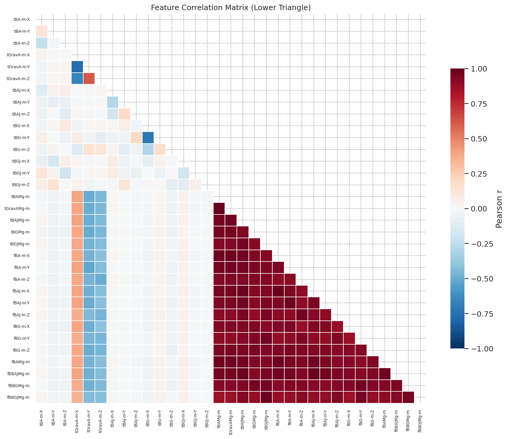
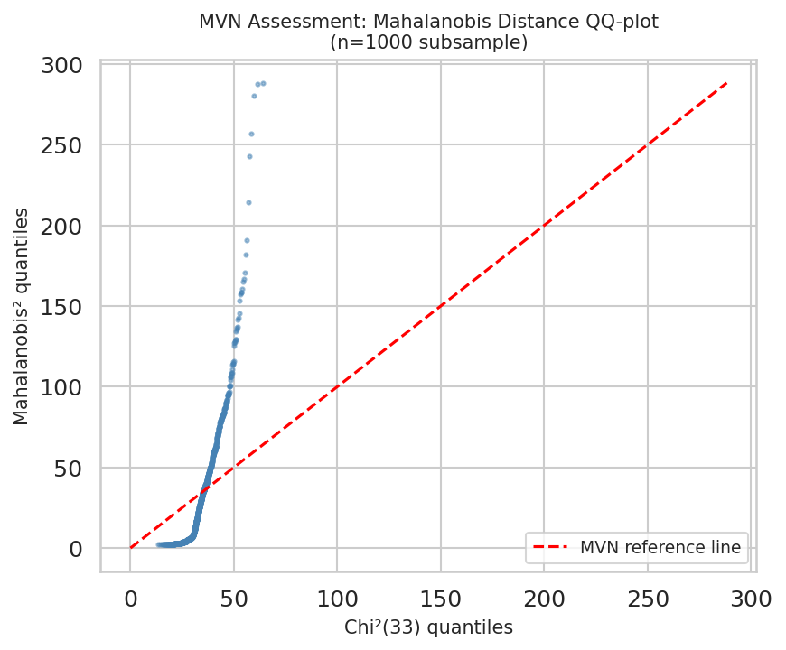
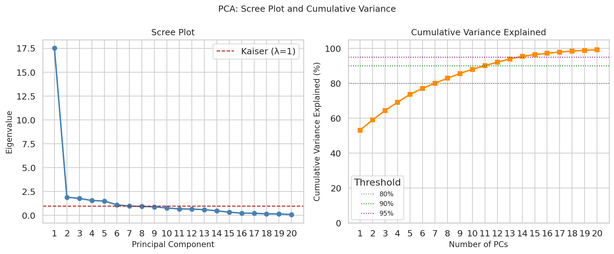
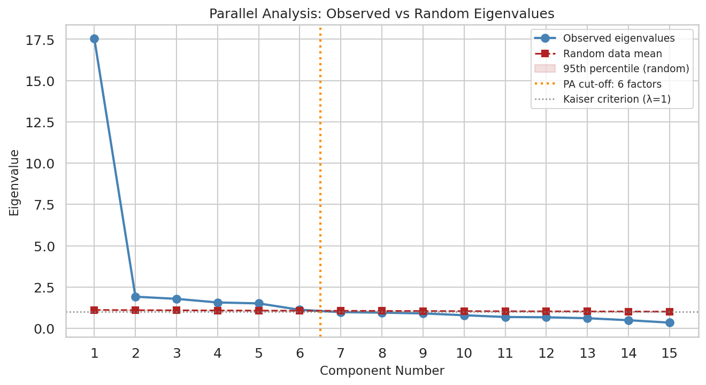
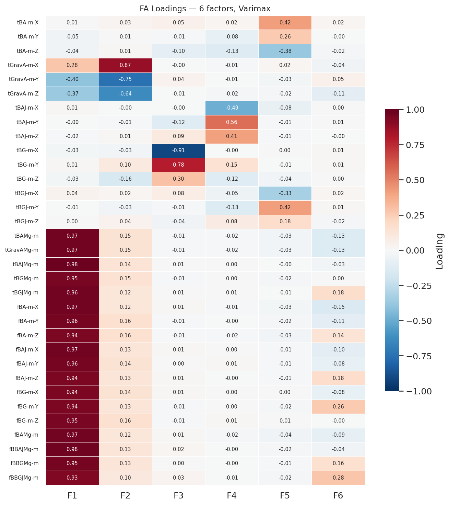
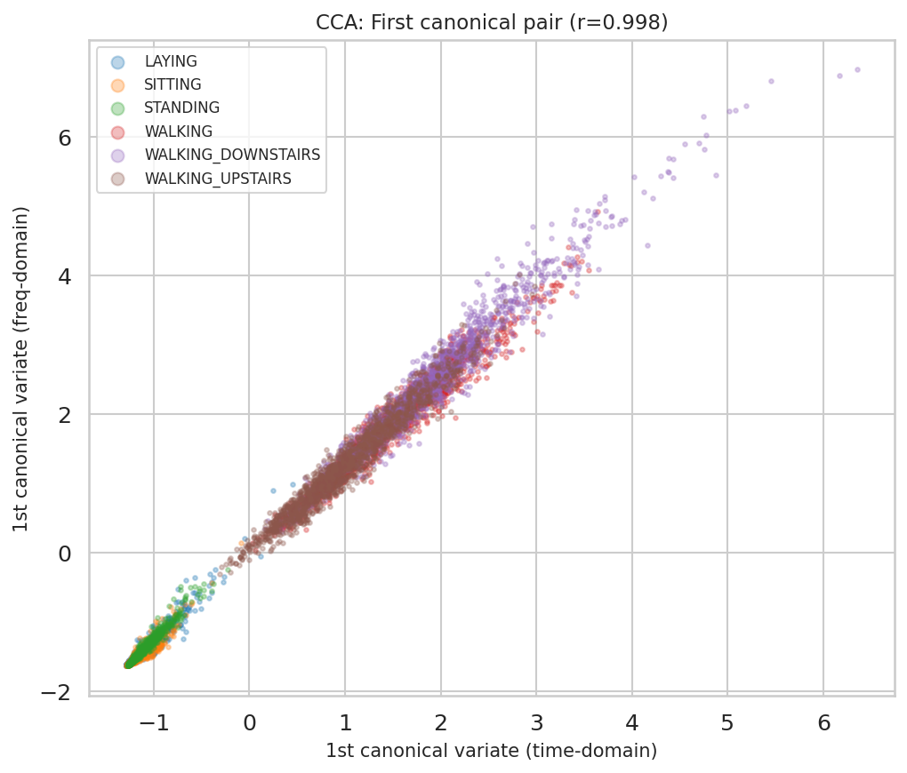

```{r setup, include=FALSE}
knitr::opts_chunk$set(
  echo    = FALSE,
  message = FALSE,
  warning = FALSE,
  fig.align = "center",
  out.width = "90%"
)
library(knitr)
library(kableExtra)
```

# Introduction

This report investigates the latent structure underlying the **Human Activity Recognition (HAR)** dataset. Thirty subjects wore a smartphone while performing six daily activities; from the raw accelerometer and gyroscope signals, 33 summary features were derived — time-domain means for body acceleration, gravity acceleration, angular velocity, and their derivatives (jerk), together with analogous frequency-domain means via the Short-Time Fourier Transform. Because many of these features measure related physical quantities, a small set of latent dimensions is expected to account for most of the observed variation.

The central question is not merely *what structure is there*, but *which analytical framework best reveals it and why*. The analysis therefore follows the full Weeks 1–8 workflow: exploratory data analysis, assumption testing, PCA as a dimensionality baseline, factor analysis with rotation as the primary latent-structure method, ICA as a complementary non-Gaussian approach, robustness checks, and CCA to characterize the relationship between the time-domain and frequency-domain variable blocks.

# Data and Preprocessing

Only the 33 continuous sensor features were retained for multivariate analysis. The `activity` variable was kept solely as a visualization label; it is a nominal six-class outcome and does not belong in the covariance-based analysis matrix. All 33 features were standardized to mean 0, standard deviation 1 before PCA, FA, ICA, and CCA so that every variable contributed on a comparable scale.

| Metric | Value |
|:-------|------:|
| Sample size | 10,299 |
| Numeric variables retained | 33 |
| Missing values | 0 |
| Duplicate rows | 0 |

Table: Data audit summary

No imputation or row deletion was required. The original features are already bounded summary statistics, but z-score standardization was applied to ensure comparability across the different sensor units and scales.

# Exploratory Analysis

The most diagnostic EDA output for a latent-structure analysis is the correlation matrix, because PCA and FA depend on systematic shared variance rather than isolated univariate patterns.

```{r fig1, fig.cap="Figure 1. Pearson correlation matrix (lower triangle) of the 33 standardized HAR features. Deep blue blocks indicate high positive correlation within sensor-domain clusters: time-domain body acceleration and jerk (top-left), frequency-domain body acceleration and jerk (center), and gyroscope features (right). Red cells indicate moderate negative correlations between gravity and body-motion features. The strong block structure confirms that the 33 features are not independent measurements but overlapping views of a smaller set of underlying movement processes."}

```

The heatmap reveals three visually distinct clusters corresponding to (1) time-domain linear acceleration, (2) frequency-domain acceleration and jerk, and (3) gyroscope rotation features. Within each cluster, correlations frequently exceed 0.90. A total of 42 feature pairs have |r| > 0.95, including at least one pair reaching |r| = 1.000 — indicating near-perfect linear dependence. This level of multicollinearity has direct implications for method selection, as discussed in the next section.

# Assumption Testing and Method Selection

The assignment requires that assumptions be tested rather than assumed. Four diagnostics were evaluated.

| Diagnostic | Result | Implication |
|:-----------|:-------|:------------|
| Overall KMO | 0.500 | Barely adequate; FA justifiable with caution |
| Bartlett's test | $p < 0.001$ | Correlation matrix $\neq$ identity; FA/PCA appropriate |
| Mardia skewness | $p < 0.001$ | Multivariate normality violated |
| Mardia kurtosis | $p < 0.001$ | Multivariate normality violated |
| Pairs with $|r| > 0.95$ | 42 (max $|r|$ = 1.000) | Near-singular covariance; ML FA not feasible |

Table: Key assumption diagnostics

```{r fig2, fig.cap="Figure 2. Mahalanobis-distance QQ-plot (n = 1,000 subsample, p = 33). Under multivariate normality, points would follow the dashed reference line. The strong upward departure at high quantiles indicates heavy tails, confirming that the data are not multivariate normal. This violation rules out Maximum Likelihood FA (which assumes MVN) and motivates ICA as a complementary approach that explicitly exploits non-Gaussianity."}

```

**Interpreting the diagnostics.** The KMO of 0.500 is at the minimum acceptable threshold by Kaiser's scale ("miserable/barely adequate"). On its own, this would be a weak endorsement of FA. However, Bartlett's test ($p \ll 0.001$) strongly rejects the identity correlation matrix, and the heatmap reveals obvious block structure. Taken together, the evidence indicates that common variance exists, but the overlap between factors is limited — consistent with a dataset where different sensor modalities (accelerometer vs. gyroscope, time vs. frequency) are mostly distinct.

Mardia's skewness and kurtosis tests both reject multivariate normality ($p \ll 0.001$). The QQ-plot confirms heavy tails. This rules out Maximum Likelihood FA, which optimizes a likelihood function that assumes MVN. Instead, **minimum residual (minres)** FA is used: it minimizes the sum of squared residuals in the off-diagonal correlation matrix via OLS, requiring no matrix inversion and converging reliably even when the covariance matrix is near-singular (Briggs & MacCallum, 2003).

**Method selection rationale.** PCA is included as a model-free baseline for variance decomposition. FA (minres) is the primary method because it separates shared from unique variance, directly answering "what latent processes generate these features?" ICA is included as a complementary check because the data are clearly non-Gaussian and ICA exploits non-Gaussianity to recover statistically independent (rather than uncorrelated) components. CCA is appropriate because the features split naturally into a time-domain block and a frequency-domain block, and the relationship between blocks is scientifically meaningful.

# PCA Results

PCA was run on the standardized feature matrix using the correlation matrix. The first principal component alone explains **53.12%** of total variance, a striking result that reflects the dominance of the dynamic-vs-static activity distinction across all sensor types. The first six components explain **77.02%** cumulatively.

| PC | Eigenvalue | Variance Explained | Cumulative Variance |
|:---|----------:|:------------------:|:-------------------:|
| PC1 | 17.531 | 53.12% | 53.12% |
| PC2 | 1.912 | 5.79% | 58.92% |
| PC3 | 1.782 | 5.40% | 64.32% |
| PC4 | 1.564 | 4.74% | 69.06% |
| PC5 | 1.507 | 4.57% | 73.63% |
| PC6 | 1.119 | 3.39% | 77.02% |

Table: First six principal components

```{r fig3, fig.cap="Figure 3. PCA scree plot (left) and cumulative variance explained (right). The dominant first eigenvalue ($\\lambda_1 = 17.53$) reflects a single global movement-intensity dimension that explains over half the total variance. Subsequent eigenvalues decrease gradually, suggesting several additional dimensions of moderate importance. The Kaiser criterion ($\\lambda > 1$) and Horn's parallel analysis (orange dashed line) both point to 6 components."}

```

The scree plot shows a very sharp drop after PC1 and then a gradual taper. PC1 functions as a "size" component: when inspecting the loadings heatmap, nearly all 33 features load positively on PC1, reflecting the overall magnitude of body motion. This explains why a single PCA component captures over half the variance — all sensors detect movement, and the dominant source of variation is whether the person is moving at all. PCs 2–6 distinguish more specific aspects of motion such as gravity direction, rotational velocity, and frequency-domain characteristics. The unrotated PCA loadings are diffuse and hard to interpret, which motivates factor analysis with rotation.

# Dimension Selection

```{r fig4, fig.cap="Figure 4. Horn's parallel analysis: observed PCA eigenvalues (blue solid line) versus the mean (dashed) and 95th-percentile (shaded band) eigenvalues from 100 random datasets of identical dimensions. The orange vertical line marks the parallel analysis cut-off, where the observed curve drops below the 95th-percentile random benchmark. Both parallel analysis and the Kaiser criterion agree on 6 dimensions."}

```

The Kaiser criterion ($\lambda > 1$) retains 6 components; Horn's parallel analysis (observed eigenvalue exceeds 95th-percentile random eigenvalue) independently suggests the same number. This convergence provides strong multi-criterion support for a 6-factor solution. Selecting 6 factors was not treated as a purely mechanical decision: the robustness section explicitly compares the 5- and 6-factor solutions to assess whether the additional factor is substantively meaningful.

# Factor Analysis Results

FA was estimated using minres with 6 factors. The unrotated solution was examined first, followed by varimax (primary orthogonal rotation) and promax (oblique, as a check on the orthogonality assumption).

| Solution | Simple-Structure Score | Cross-Loadings ($|l| > 0.30$) |
|:---------|:---------------------:|:-----------------------------:|
| Unrotated (6) | 0.576 | 4 |
| Varimax (6) | 0.906 | 2 |
| Promax (6) | 0.906 | 2 |

Table: Comparison of six-factor FA solutions

```{r fig5, fig.cap="Figure 5. Varimax-rotated factor loading heatmap (6 factors, minres estimator). Most features load strongly on exactly one factor, with near-zero cross-loadings, indicating clear simple structure. Compare with the unrotated PCA loadings in the analysis code: rotation transforms the diffuse PC1 'size' component into domain-specific factors that align with the physical sensor partition."}

```

The simple-structure score increases from 0.576 (unrotated) to 0.906 (varimax), and only 2 variables have cross-loadings above 0.30 — good performance for a dataset with 42 near-collinear feature pairs. Ten variables had communality below 0.40 and 10 had uniqueness above 0.60, so the model is informative but not complete.

**Factor interpretation.** The varimax rotation produces factors that align clearly with the physical sensor architecture of the HAR dataset:

- **F1 — Jerk and magnitude intensity:** Highest loadings on `tBodyAccJerkMag-mean` (+0.981), `fBodyBodyAccJerkMag-mean` (+0.976), `fBodyAccJerk-mean-X` (+0.967), `fBodyAccMag-mean` (+0.966). This factor captures the overall intensity of linear body motion — it is large during dynamic activities (walking, climbing stairs) and small during static postures.
- **F2 — Gravity orientation:** Highest loadings on `tGravityAcc-mean-X` (+0.868), `tGravityAcc-mean-Y` (−0.749), `tGravityAcc-mean-Z` (−0.642). This factor encodes the direction of gravity relative to the body — distinguishing lying from sitting from standing, independently of whether the subject is moving.
- **F3 — Gyroscope rotation axis:** Highest loadings on `tBodyGyro-mean-X` (−0.911), `tBodyGyro-mean-Y` (+0.785), `tBodyGyro-mean-Z` (+0.296). This factor represents the directional pattern of angular velocity from the gyroscope.
- **F4 — Body acceleration jerk:** Highest loadings on `tBodyAccJerk-mean-Y` (+0.557), `tBodyAccJerk-mean-X` (−0.488), `tBodyAccJerk-mean-Z` (+0.407). This factor isolates the rate of change of linear acceleration — sensitive to sudden directional changes in movement.
- **F5–F6 — Residual structure:** The fifth and sixth factors have smaller, less interpretable loadings. The sixth factor's largest absolute loading is only 0.258. Both are statistically retained by parallel analysis but their substantive meaning is unclear. The six-factor solution is preferred as the primary model; a five-factor solution is a plausible and slightly more parsimonious alternative.

**Rotation choice.** Varimax is used as the primary rotation because the six factors correspond to physically distinct sensor modalities (accelerometer vs. gyroscope, time vs. frequency, linear vs. angular), which are approximately orthogonal by construction. The promax rotation yields the same simple-structure score (0.906) and the same number of cross-loadings. The largest absolute inter-factor correlation under promax is 0.482, which is moderate — confirming that the factors are not perfectly orthogonal but that the varimax approximation is reasonable.

# ICA and Robustness

**ICA.** Independent Component Analysis (fastICA, logcosh contrast, 6 components) was applied because the data clearly violate multivariate normality. The recovered independent components have substantial excess kurtosis ranging from −1.19 to 40.73, confirming that ICA has genuine non-Gaussian structure to separate. Comparing the ICA mixing matrix with the varimax loading heatmap reveals broadly similar variable groupings: jerk/magnitude features, gravity features, and gyroscope features cluster together in both solutions, providing convergent validity for the FA factor structure. FA remains the primary method because it provides communalities, uniquenesses, and a deterministic (up to rotation sign) solution; ICA components are unordered and sign-ambiguous, making structured interpretation harder.

**Robustness checks** were conducted in three ways:

1. *Factor number sensitivity.* The five-factor and six-factor solutions produce identical simple-structure scores (0.906), differing only in that the six-factor solution has slightly higher total communality. This confirms that the sixth factor does not improve interpretability — it is retained on statistical grounds (parallel analysis) but should be acknowledged as weak.

2. *Rotation sensitivity.* Varimax and promax yield matching simple-structure scores and cross-loading counts. The promax solution's largest inter-factor correlation is 0.482, which is moderate but not large enough to reverse the preference for the orthogonal model.

3. *Subsample stability.* Five independent 50% random subsamples were drawn and FA was re-estimated on each. The mean absolute factor alignment across splits was 0.847 and the mean top-variable Jaccard overlap was 0.429. These values indicate acceptable stability — the broad factor structure is consistent across subsamples even if the exact loading magnitudes fluctuate.

# CCA and Multivariate Assessment

CCA was appropriate for this dataset because the 33 features divide naturally into two theoretically motivated blocks: a **time-domain block** (20 features beginning with `t`) and a **frequency-domain block** (13 features beginning with `f`). Frequency-domain features are derived from time-domain features via the Short-Time Fourier Transform, so this is a non-arbitrary, physically grounded partition. One time-domain variable (`tGravityAccMag-mean`) was found to be perfectly linearly dependent on others and was removed prior to CCA.

| Canonical Variate | Canonical Correlation |
|:-----------------:|:---------------------:|
| CV1 | 0.9975 |
| CV2 | 0.9373 |
| CV3 | 0.9164 |
| CV4 | 0.6168 |

Table: First four canonical correlations (time-domain vs. frequency-domain)

```{r fig6, fig.cap="Figure 6. First canonical variate pair: time-domain canonical score (x-axis) vs. frequency-domain canonical score (y-axis), coloured by activity. The near-perfect first canonical correlation ($r = 0.9975$) produces a tight diagonal band, confirming that both blocks encode essentially the same latent activity information. Dynamic activities (WALKING variants) cluster at one extreme; static activities (SITTING, STANDING, LAYING) at the other. This pattern is consistent with FA Factor 1 (jerk/magnitude) and Factor 2 (gravity orientation) driving the primary axis of variation."}

```

The first three canonical correlations (0.9975, 0.9373, 0.9164) are exceptionally high, confirming that the time-domain and frequency-domain blocks encode nearly identical latent structure. This is the CCA counterpart of the extreme multicollinearity seen in the correlation heatmap: the 33 features are not 33 independent measurements but multiple redundant views of the same ~6 underlying physical processes, simultaneously captured in both temporal and spectral representations.

The sharp drop from CV3 (0.916) to CV4 (0.617) suggests that three dominant shared latent dimensions span both blocks, with the fourth canonical dimension reflecting more residual, activity-specific variation.

**Multivariate regression** was not pursued because `activity` is a nominal six-class label rather than a continuous multivariate response. Linear Discriminant Analysis would be appropriate for predicting group membership from the FA factor scores, but falls outside the Weeks 1–8 toolkit.

# Discussion

The four methods converge on a consistent picture: the 33 HAR features are governed by a small number of latent dimensions that correspond to physically interpretable sensor-domain partitions.

**PCA** establishes that dimensionality reduction is highly effective: a single dominant component explains over half the variance, and six components together explain 77%. However, the unrotated PCA loadings are diffuse (PC1 loads positively on nearly all features), which is why FA with rotation is needed.

**FA with varimax** is the most informative method for this dataset. The rotated solution achieves high simple structure (0.906), and the four strongest factors align with physically meaningful constructs: jerk/magnitude intensity (F1), gravitational posture (F2), gyroscope rotation direction (F3), and acceleration jerk direction (F4). The KMO of 0.500 is at the minimum acceptable threshold, meaning the FA results should be treated as informative rather than definitive. The Bartlett test and the heatmap's block structure provide the primary empirical justification for applying FA.

**ICA** confirms that the factor structure is not a mathematical artefact: independent components recovered under a completely different criterion (statistical independence) broadly agree with the FA factors.

**CCA** confirms that the time/frequency redundancy explains the multicollinearity: once the latent structure is identified via FA, the near-perfect canonical correlations ($r_1 = 0.9975$) make clear why so many feature pairs reach $|r| > 0.95$ — they measure the same underlying processes.

The main limitation is that the 33 features are pre-engineered means from fixed 2.56-second windows of the raw sensor streams. The latent dimensions identified here are dimensions of the *feature space*, not necessarily unique physical mechanisms. A multivariate analysis of the raw time series (e.g., dynamic factor models) would provide a more complete characterization.

# Conclusion

The HAR data exhibit clear, stable latent structure. A **six-factor varimax solution** is the most defensible primary model: it is supported by both the Kaiser criterion and Horn's parallel analysis, achieves simple-structure score 0.906, and produces four factors with straightforward physical interpretations (jerk/magnitude intensity, gravity orientation, gyroscope rotation, linear acceleration jerk). Two weaker factors (F5–F6) are statistically retained but should be interpreted cautiously.

A five-factor alternative is a plausible and slightly more parsimonious option because the five-factor and six-factor solutions have identical simple-structure scores. ICA and CCA both corroborate the FA structure: ICA through convergent variable groupings, CCA through near-perfect canonical correlations that reflect the time/frequency redundancy built into the HAR feature set.

# References

Anguita, D., Ghio, A., Oneto, L., Parra, X., & Reyes-Ortiz, J. L. (2013). A public domain dataset for human activity recognition using smartphones. *ESANN 2013*.

Briggs, N. E., & MacCallum, R. C. (2003). Recovery of weak common factors by maximum likelihood and ordinary least squares estimation. *Multivariate Behavioral Research, 38*(1), 25–56.

Horn, J. L. (1965). A rationale and test for the number of factors in factor analysis. *Psychometrika, 30*(2), 179–185.

Kaiser, H. F. (1974). An index of factorial simplicity. *Psychometrika, 39*(1), 31–36.

Mardia, K. V. (1970). Measures of multivariate skewness and kurtosis with applications. *Biometrika, 57*(3), 519–530.

# AI Use

Claude (Anthropic) was used for analysis planning, interpretation guidance, and editing support. All code was run, reviewed, and validated by the author. The main analysis code file is `analysis.Rmd` in the project repository.
